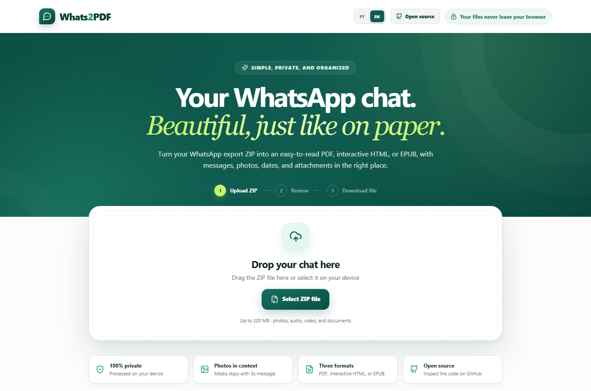

<div align="center">



# Whats2PDF

**Turn exported WhatsApp chats into PDF, interactive HTML, or EPUB — without sending anything to any server.**

[](https://github.com/keverupp/whats2pdf)
[](https://nextjs.org)
[](https://react.dev)
[](https://www.typescriptlang.org)
[](LICENSE)

[Português](README.md) · **English**

[Repository](https://github.com/keverupp/whats2pdf) · [How to use](#-how-to-use) · [Run locally](#-running-locally) · [Contribute](#-contributing)

</div>

---

## 🌱 Open source project

Whats2PDF is an **open source project with public code, free to inspect**, published at:

> **[github.com/keverupp/whats2pdf](https://github.com/keverupp/whats2pdf)**

Every line of code that runs in your browser is there — there is no closed component, hidden service, or server-side processing step. Anyone can audit it line by line, run it locally, fork it, and adapt it.

## ✨ Highlights

- **100% local processing.** The ZIP is read in the browser; the chat is never uploaded, stored, or processed by an API.
- **Three output formats.** Paginated PDF, interactive HTML (works offline), and EPUB.
- **Media in context.** Photos, audio, video, and documents stay with the message they came from.
- **Preview before exporting.** See how the chat will look, set the title, and pick who you are in the conversation.
- **Bilingual.** Interface and exported files in Portuguese or English, with automatic detection.
- **Zero configuration.** No environment variables, database, or external service.

## 🔒 Privacy

All ZIP processing happens locally, on your device. Nothing goes over the network: no upload, no content telemetry, no remote storage. Because the code is open, that claim is verifiable — you don't have to trust it, you can check it.

## 🧭 How to use

1. **In WhatsApp**, open the chat or group you want to export.
2. Tap the **three dots** menu in the top-right corner.
3. Choose **More → Export chat** and select **include media** to bring photos, audio, and video along.
4. **In Whats2PDF**, upload the generated `.zip`, review the preview, adjust the options, and download the final file.

## 📦 Export formats

| Format | File | When to use | Limitation |
| --- | --- | --- | --- |
| **PDF** | `.pdf` | Archiving, printing, or sharing a searchable A4 document | Audio and video are attached, not playable inside the PDF |
| **Interactive HTML** | `.zip` | Re-reading in a browser, offline, with working audio and video | Extract the ZIP and open `index.html`, keeping the `media` folder next to it |
| **EPUB** | `.epub` | Adjustable reading on e-readers and reading apps | Media playback depends on the reader and the codec |

## ✅ What is supported

- Exports in **Portuguese and English**, in the usual Android and iPhone formats.
- Multi-line messages, system notices, and date separators along the conversation.
- **JPEG, PNG, WebP, and GIF** images the browser can decode.
- **Audio and video** playback in the chat preview.
- Original audio and video embedded as attachments, with clickable cards in compatible readers.
- Documents identified in the timeline.
- Choosing which participant represents you (messages aligned to the right).
- Files up to **200 MB**.

### Known limitations

- **HEIC** images depend on browser support; when they can't be decoded, they appear as identified attachments.
- In the PDF, audio and video are attachments — there is no universal inline playback.
- In the EPUB, media playback varies by reader.

## 🌍 Languages

The interface is available in **Portuguese and English**. The language is picked automatically from the browser and may switch to English when an English WhatsApp export is detected. The **PT / EN** switch allows manual control, and exported files follow that choice.

## 🚀 Running locally

Requirements: **Node.js 20.9 or newer**.

```bash
git clone https://github.com/keverupp/whats2pdf.git
cd whats2pdf
npm install
npm run dev
```

Open `http://localhost:3000` and select the ZIP produced by WhatsApp's **Export chat** option.

### Scripts

| Script | What it does |
| --- | --- |
| `npm run dev` | Development server |
| `npm run build` | Production build |
| `npm start` | Serves the production build |
| `npm run lint` | ESLint |
| `npm run typecheck` | TypeScript type checking |

Before opening a PR, it's worth running `npm run lint`, `npm run typecheck`, and `npm run build`.

## ☁️ Deploy

### Vercel

1. Push the repository to GitHub.
2. Import it at [vercel.com/new](https://vercel.com/new).
3. Keep the **Next.js** preset and deploy.

There are no environment variables, databases, or external services to configure.

### Other platforms

Any Node.js host can run `npm run build` and `npm start`. The project can also be adapted for static export, since the page doesn't depend on server routes.

## 🧱 Stack

[Next.js 16](https://nextjs.org) (App Router) · [React 19](https://react.dev) · [TypeScript](https://www.typescriptlang.org) · plain CSS (no styling framework) · [JSZip](https://stuk.github.io/jszip/) · [jsPDF](https://github.com/parallax/jsPDF) · [pdf-lib](https://pdf-lib.js.org) · [lucide-react](https://lucide.dev)

```text
src/
├── app/
│   ├── apple-icon.tsx           # generated iOS icon
│   ├── globals.css              # the whole app design
│   ├── icon.svg                 # favicon
│   ├── layout.tsx               # metadata and document language
│   └── page.tsx
├── components/
│   └── whatsapp-converter.tsx   # UI: upload, options, and preview
└── lib/
    ├── exports.ts               # interactive HTML and EPUB
    ├── i18n.ts                  # PT/EN copy and language detection
    ├── pdf.ts                   # PDF generation
    ├── types.ts
    └── whatsapp.ts              # ZIP reading and parsing
```

## 🤝 Contributing

Contributions are welcome: open an [issue](https://github.com/keverupp/whats2pdf/issues) to report a problem or suggest something, or send a pull request.

When reporting a chat-parsing bug, describe **which system the export came from** (Android or iPhone) and **in which language** — date formats and attachment markers differ between them. Never attach real conversations: prefer a small, anonymized excerpt.

## 📄 License

Released under the [MIT](LICENSE) license — use, modify, and redistribute freely, keeping the copyright notice.
